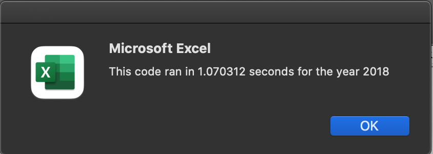

# VBA_Challenge

## Overview of Project
To perform an analysis and comparison of outcomes based on methods of execution .
The purpose of this analysis was to help Steve analyze his dataset and quickly calculate the result based on values provided
## Results
Using code refactoring I was able to reduce the overall calcultion time for both data sets (2017 and 2018) by a considerble amount .
These results were reproducible repeatedly as seen below:
#### Images

Code differences seen here :
#### Code links
[All Stock Analysis code](https://github.com/Jusharry/stock-analysis/blob/2cd8666d63d47cb3b4cee08637ce287cd0fb82ac/Resources/All_Stock_Analysis_code.png)

[VBA Challenge code (1)](https://github.com/Jusharry/stock-analysis/blob/4a861946a7bbfbbe16d5ad1ca747bf689560275c/Resources/VBA_Challenge%20code(1).png)

[VBA Challenge code (2)](https://github.com/Jusharry/stock-analysis/blob/4a861946a7bbfbbe16d5ad1ca747bf689560275c/Resources/VBA_Challenge%20code%20(2).png)

Differences in stock performance for the given years:
### Stock Comparison
[2017 Stock](https://github.com/Jusharry/stock-analysis/blob/2cd8666d63d47cb3b4cee08637ce287cd0fb82ac/Resources/VBA_2017.png)

[2018 Stock](https://github.com/Jusharry/stock-analysis/blob/2cd8666d63d47cb3b4cee08637ce287cd0fb82ac/Resources/VBA_2018.png)

## Summary
The advantages of refactoring code are many including reducing overall time to completion of project and also discovering more elegant/efficient ways to achievinga a particular outcome .
The main disadvantage to refactoring code that I see is that without a clear understanding of the original code the refactored code can inrroduce new unforseen errors which may take an even longer time to unravel .

In terms of this particular script because we did not initially use arrays for much of the variable assignment it was very tricky to get the arrays to compile properly or pass and store each value in a way that the next bit of code would execute without issue.
However the overall time to completion was less than if the code neede to be crafted from scratch.

